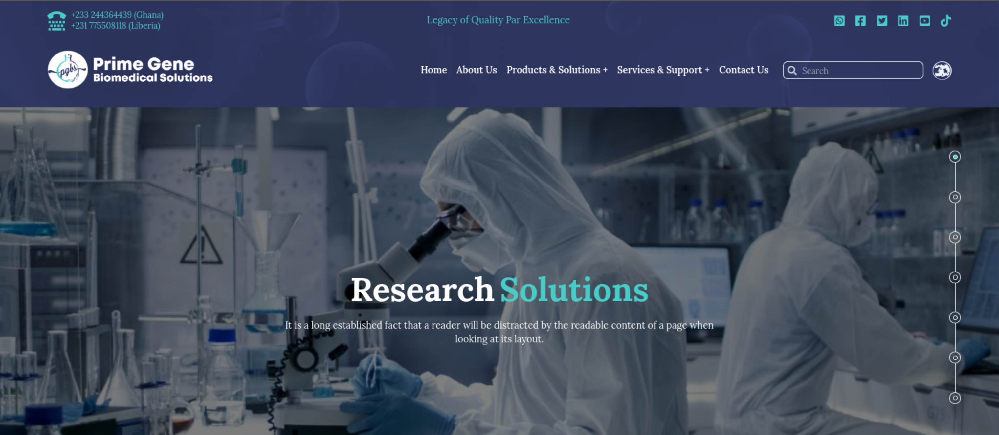

# Prime Gene Biomedical solutions

#### Your trusted supplier for biomedical equipment, reagents, and solutions

This project is the website for Prime Gene Biomedical Solutions. Prime Gene Biomedical Solutions is a supplier of biomedical equipment, reagents, and solutions in Liberia. I handled the design of the website though mainly dictated by the client. The website is hosted on Hostinger. Please note that some parts of the website are still under development.

### Technologies:

- React
- React Router DOM
- Tailwind CSS
- react-i18next
- Next UI
- Swiper

#### Deployment

The live website is deployed and hosted on Hostinger. You can find the link to the live website below.

[Live Website](https://primegenebiomedicalsolutions.com/)

#### Key Lessons Learnt:

- Responsive web design with Tailwind CSS.
- Next UI components in React applications
- Internationalization with react-i18next
- Use of third-party Libraries like Swiper, react-hook-form, etc
- React Router Dom
- Layouts
- React Props.
- React state.
- Reusable Components.
- Deploying react app to hostinger.
- Domain purchase and configuration for website hosting on Hostinger.
- Standard React file/folder structure.

